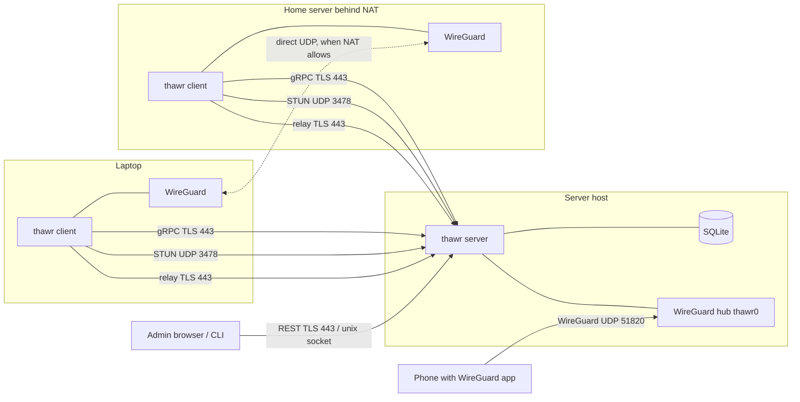
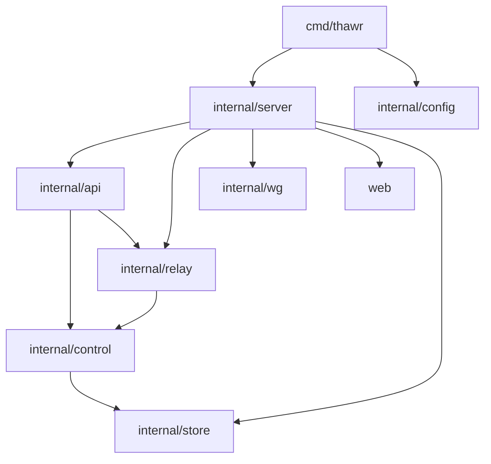
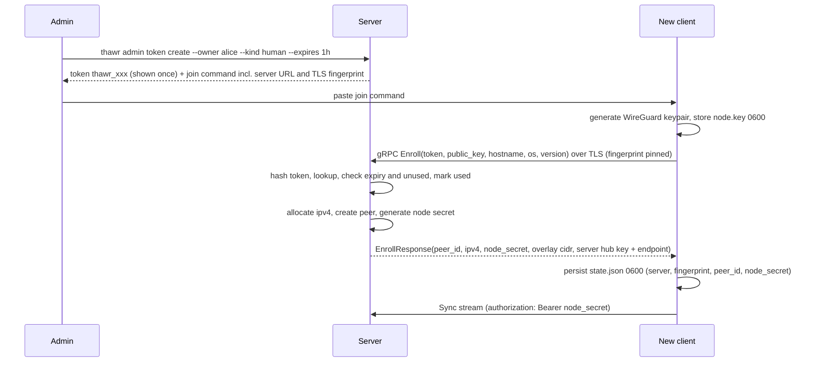
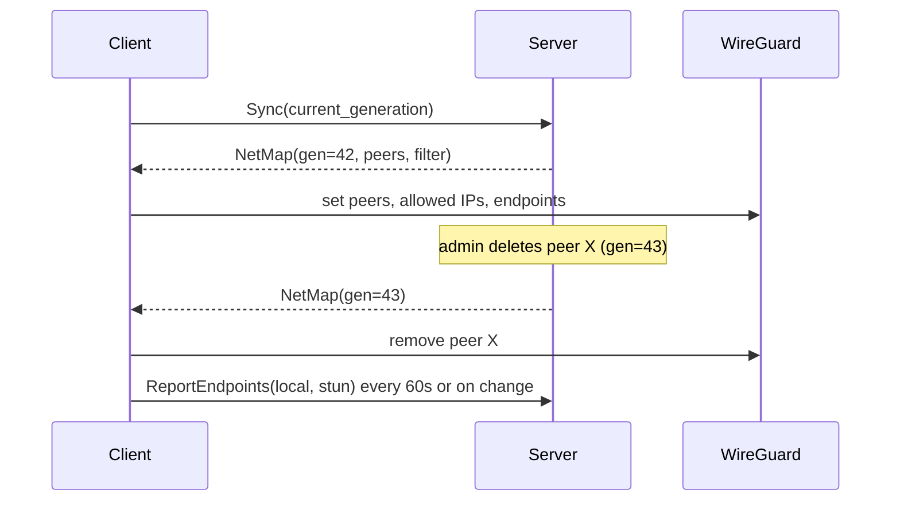
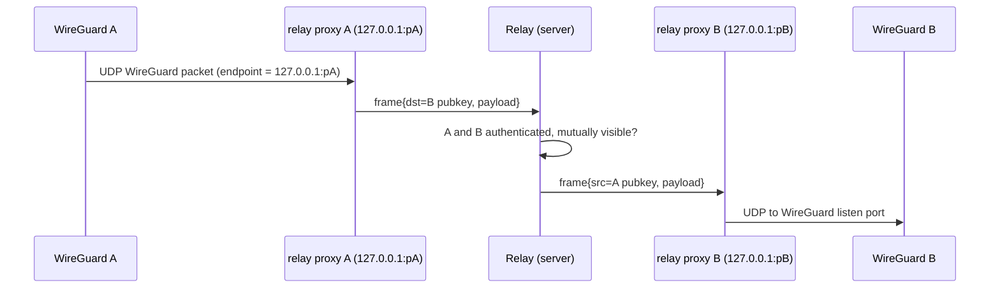

# Thawr — Architecture

This document is normative. Implementation sessions follow it; changes go
through an ADR in `docs/adr/`.

## 1. Components

One binary, three roles:

| Role | Command | Runs where | Responsibilities |
|---|---|---|---|
| Server | `thawr server --config server.yaml` | One host with a public IP or forwarded ports | Peer registry, enrollment, key distribution, policy evaluation, STUN, relay, WireGuard hub for mobile peers, admin REST API and UI |
| Client | `thawr client up|down|status` | Every laptop, server, VM | Generates and holds the node key, configures the local WireGuard interface, discovers endpoints, probes direct paths, falls back to relay, enforces the receiver-side port filter |
| Admin | `thawr admin ...` | On the server host (Unix socket) or remotely (REST with a session) | Users, tokens, peers, policy check and reload, mobile QR export |

Network ports on the server, all configurable:

| Port | Protocol | Purpose |
|---|---|---|
| 443 | TCP, TLS | gRPC (clients), REST + admin UI (browsers), relay (HTTP Upgrade `thawr-relay/1`) |
| 3478, 3479 | UDP | STUN. Two ports so a client can detect endpoint-dependent (symmetric) NAT |
| 51820 | UDP | Server's own WireGuard interface (the hub). Used by mobile peers and by any peer as a stable direct endpoint to the server |

## 2. Packages

Dependencies point downward only. `cmd/thawr` parses flags and hands
the config to `internal/server`, which wires everything; nothing below
`cmd` imports a sibling that is not listed here.

| Package | Single responsibility | Exposes | Depends on |
|---|---|---|---|
| `internal/config` | Load one YAML file, apply defaults, validate | `Load(path) (*Config, error)`, `Config` struct, `Default()` | stdlib, yaml |
| `internal/store` | Persist peers, users, tokens, policy generation in SQLite; run migrations | `Open(dsn) (*Store, error)`, `Store.Peers()`, `Store.Users()`, `Store.Tokens()`, `Store.Meta()`, each a small interface with ctx-first methods | `modernc.org/sqlite` |
| `internal/control` | Everything that decides: enrollment, registry, key distribution (netmap), policy compilation, endpoint tracking, IP allocation | `Enroller`, `Registry`, `Policy` (parse + compile), `NetMapBuilder`, `EndpointTable`, `Allocator` | `internal/store` |
| `internal/wg` | Talk to a WireGuard device without knowing about Thawr | `Device` interface, `Open(ctx, Options)` (kernel via wgctrl on Linux, else wireguard-go configured through its in-process IPC API, no UAPI socket), `Filter` interface (spec 006), `wgtest.Fake` | `wgctrl`, `wireguard-go`, netlink / nftables |
| `internal/relay` | Forward opaque packets between authenticated peers; local UDP proxy on the client | `Server`, `Client`, frame codec | `internal/control` (for auth + visibility check via a small interface) |
| `internal/api` | gRPC service and REST handlers; translate wire types to `control` calls; no business logic | `NewGRPC(deps)`, `NewREST(deps)`, `Combine` (one listener for both), protobuf under `internal/api/proto` generated with buf via `make proto` | `internal/control`, `internal/relay` |
| `internal/client` | Device side independent of the CLI: state directory (node key, enrollment state), TLS fingerprint pinning, the Enroll call; the daemon arrives with spec 003 | `Enroll(ctx, Options)`, `LoadState`, `SaveState`, `Forget`, `PinnedTLSConfig`, `ProbeFingerprint` | `internal/api/proto`, `internal/wg` |
| `internal/server` | Compose the server: data dir, store, server key, TLS, hub interface, policy, listeners; startup order, readiness, reload, shutdown | `New(cfg, Deps)`, `Run(ctx, reload)`, `Check()`, `Status(ctx)` | `internal/config`, `internal/store`, `internal/wg`, `internal/control`, `internal/api`, `web` |
| `web` | Static admin UI, embedded | `embed.FS` | nothing |
| `cmd/thawr` | Flags, config, dependency wiring, signal handling | `main` | all of the above |

Interfaces are declared in the consuming package. `control` declares the
storage interfaces it needs; `store` satisfies them. `api` declares what
it needs from `control`; tests use fakes.

## 3. Identity model

Every entity that can hold a WireGuard key is a **peer**. A peer has:

| Field | Meaning |
|---|---|
| `id` | 128-bit random, hex |
| `name` | Unique, DNS-label safe, e.g. `alice-laptop`; derived from hostname at enrollment, admin can rename |
| `kind` | `human`, `server`, `agent`. Informational in v1; phase 2 attaches workload identity semantics without changing the schema |
| `mode` | `agent` (runs `thawr client`, participates in NAT traversal) or `static` (plain WireGuard config, e.g. a phone; routed via the hub) |
| `owner` | Optional reference to a user. Servers and agents may be unowned and are addressed by tags |
| `tags` | Set of `tag:name`. Policy addresses peers by owner, group, or tag |
| `public_key` | WireGuard public key. Private key never leaves the device for `agent` peers |
| `ipv4` | Overlay address, `/32`, allocated by the server from `overlay.cidr` |
| `node_secret_hash` | SHA-256 of the bearer secret an `agent` peer uses on the control channel |
| `last_seen_at`, `created_at`, `expires_at` | Lifecycle |

**Users** are local accounts with a name, role (`admin`, `member`), and
an argon2id password hash. Users log into the admin UI and own peers.
Members can list their own peers and create tokens for themselves;
admins can do everything. OIDC, when enabled, maps an external subject to
a local user record. The policy engine only ever sees users, groups and
tags, so the identity source is irrelevant to it.

**Enrollment tokens** are single-use secrets created by an admin (or a
member for their own peers). A token pins: owner, kind, tags, expiry.

## 4. Data flows

### 4.1 Server bootstrap

On first start with `public_addr: vpn.example.com` the server creates
`data_dir` (default `/var/lib/thawr`), opens `thawr.db`, runs migrations,
generates its WireGuard key (`server.key`, 0600), generates a self-signed
TLS certificate valid 10 years with SAN = public host
(`tls/cert.pem`, `tls/key.pem`), brings up `thawr0` with `100.64.0.1/10`,
starts STUN, relay, gRPC, REST, and prints the TLS fingerprint. Subsequent
starts reuse everything. Spec 001.

### 4.2 Enrollment

Token secret: 32 bytes from `crypto/rand`, base64url, prefixed
`thawr_`. The server stores only SHA-256(secret). Default expiry 1 hour,
maximum 30 days. A used or expired token is rejected with the same error
code. Spec 002.

### 4.3 Key distribution (netmap sync)

The server holds a **netmap generation** counter. Any change to peers,
endpoints, or policy increments it. Each client holds one server-streaming
gRPC call `Sync`. On connect and on every generation change the server
computes that peer's view:

- the peers it may talk to (policy says A→B or B→A allows at least one
  port), each with public key, ipv4, current endpoint candidates, online
  flag
- the hub as a peer with AllowedIPs covering every `static` peer's address
- the receiver-side filter rules for this peer (source ipv4 → allowed
  proto/ports)

The client diffs the netmap against the WireGuard device: adds, updates
(endpoint, allowed IPs), removes peers; installs the filter. Removing a
peer on the server propagates to every client within 5 seconds. Spec 003.

### 4.4 Direct connectivity

Clients learn their endpoints: local interface addresses with the
WireGuard listen port, plus the server-reflexive address from STUN on
both server STUN ports. If the two reflexive ports differ, the NAT is
endpoint-dependent and the client reports `symmetric: true`.

To reach peer B, client A orders B's candidates (same-LAN first, then
reflexive, then hub-stable endpoints), sets B's WireGuard endpoint to the
first candidate and sends a probe (ICMP echo to B's overlay address)
which triggers a WireGuard handshake. B does the same toward A with the
identical ordering, so both sides punch holes simultaneously. A candidate
is accepted when `last_handshake_time` advances within 2 seconds. If the
list is exhausted (10 seconds at most) the path falls back to the relay
and re-probing repeats every 60 seconds. No userspace packet
multiplexing: the kernel or `wireguard-go` device is always the one
sending. Spec 004.

### 4.5 Relay fallback

Each client keeps one TLS connection to `/relay` (HTTP/1.1 Upgrade,
authenticated with the node secret). For every relayed peer it opens one
local UDP socket on `127.0.0.1` and points the WireGuard endpoint at it.
Frames are `type(1) | key(32) | length(2) | payload`. The relay only
forwards between peers that are mutually visible in the current netmap
and never sees anything but WireGuard ciphertext. Spec 005.

### 4.6 Policy evaluation

The policy file is YAML with `groups`, `tagOwners`, and `acls`. Rules
have `action` (only `accept`), `src` selectors, `dst` selectors with
ports, optional `proto`. Selectors: `*`, `user:name`, `group:name`,
`tag:name`, `peer:name`, CIDR. Default deny.

Compilation produces, for every ordered pair (src peer, dst peer), the
set of allowed (proto, port ranges). Two peers are **visible** to each
other when either direction is non-empty. Enforcement:

1. Key distribution: a client only receives keys of visible peers. This
   alone stops any traffic between peers with no relationship.
2. Receiver-side filter: the destination client drops packets from source
   overlay addresses not permitted for that proto/port. On Linux with
   kernel WireGuard this is an nftables table `thawr` with a chain on
   `thawr0`; with `wireguard-go` it is a userspace stateful filter in the
   TUN read path. Return traffic of accepted flows is allowed (stateful).
3. Hub-side filter: the server applies the same rules when forwarding for
   `static` peers.

The server reloads the policy on `SIGHUP`, on `thawr admin policy reload`,
and validates with `thawr admin policy check file.yaml`. An invalid file
never replaces a valid loaded policy. Spec 006.

### 4.7 Mobile (static) peers

`thawr admin peer add-mobile --owner alice --name alice-phone` generates a
WireGuard keypair in server memory, stores the public key as a `static`
peer, renders a standard WireGuard `.conf` with `Endpoint =
public_addr:51820`, `AllowedIPs = <overlay cidr>`, and shows it once as
a QR code (terminal or admin UI). The private key is discarded after
rendering. The hub forwards between the phone and mesh peers; the
threat model records that the server sees plaintext for static peers
only. Spec 008.

## 5. Wire interfaces

### gRPC `thawr.v1.Control`

| RPC | Auth | Purpose |
|---|---|---|
| `Enroll(EnrollRequest) EnrollResponse` | enrollment token | Register a new agent peer |
| `Sync(SyncRequest) stream NetMap` | node secret | Long-lived netmap push |
| `ReportEndpoints(EndpointReport) Empty` | node secret | Candidates + NAT type |
| `ReportPath(PathReport) Empty` | node secret | direct/relay state per peer (for status and admin UI) |
| `RotateKey(RotateKeyRequest) RotateKeyResponse` | node secret | Replace the WireGuard key; old key valid until next generation is acknowledged |
| `Leave(Empty) Empty` | node secret | Peer removes itself |

Node secret travels as gRPC metadata `authorization: Bearer <secret>`.
Every message carries `client_version`; the server rejects versions older
than its `min_client_version`.

### REST `/api/v1` (admin)

`POST /login`, `POST /logout`, `GET /me`, `GET /status`, `GET|POST /users`,
`GET|POST /tokens`, `DELETE /tokens/{id}`, `GET /peers`,
`GET|PATCH|DELETE /peers/{name}`, `POST /peers/mobile`, `GET /policy`,
`POST /policy/check`, `POST /policy/reload`. JSON bodies. Browser
sessions are in memory (12 h) behind one `HttpOnly`, `Secure`,
`SameSite=Strict` cookie; the session's CSRF token is returned by
`/login` and `/me` and must be sent as `X-CSRF-Token` on mutating calls.
The Unix socket exposes the same API without login as the local admin;
access is filesystem permission (`root` and group `thawr`).

### Client local API

`thawr client status` talks to the running daemon over
`/var/run/thawr/client.sock` (Windows: `\\.\pipe\thawr`) with a tiny
JSON-over-HTTP API: `GET /status`, `POST /down`, `POST /reprobe`. Spec
007.

## 6. Storage

SQLite, WAL mode, single writer. Tables: `users`, `peers`,
`enrollment_tokens`, `meta` (netmap generation, schema version, server
key fingerprint). Endpoints, relay sessions and path state are ephemeral
and kept in memory in `control.EndpointTable`; a restart simply waits for
clients to re-report. Migrations are `NNNN_name.sql` files embedded and
applied in a transaction with the version recorded in `meta`.

Indexes: `peers(public_key)` unique, `peers(name)` unique,
`peers(owner_id)`, `enrollment_tokens(secret_hash)` unique,
`enrollment_tokens(expires_at)`.

## 7. Client state

| Path | Content | Mode |
|---|---|---|
| `/var/lib/thawr/client/node.key` | WireGuard private key | 0600 |
| `/var/lib/thawr/client/state.json` | server URL, TLS fingerprint, peer id, node secret, last netmap | 0600 |

macOS: `/Library/Application Support/Thawr/`. Windows: `%ProgramData%\Thawr\`.
The cached netmap lets the client restore WireGuard peers before the
server is reachable, so a mesh keeps working through a server outage as
long as endpoints have not changed.

## 8. External dependencies

| Module | Use | License |
|---|---|---|
| `golang.zx2c4.com/wireguard` (wireguard-go) | Userspace WireGuard, TUN | MIT |
| `golang.zx2c4.com/wireguard/wgctrl` | Configure kernel and userspace WireGuard | MIT |
| `golang.zx2c4.com/wireguard/windows` | Windows TUN (wintun) helpers | MIT; wintun.dll under its Prebuilt Binaries License |
| `modernc.org/sqlite` | SQLite, pure Go | BSD-3-Clause |
| `google.golang.org/grpc`, `google.golang.org/protobuf` | Control channel | Apache-2.0, BSD-3-Clause |
| `gopkg.in/yaml.v3` | Config and policy | MIT and Apache-2.0 |
| `golang.org/x/crypto` | argon2id password hashing | BSD-3-Clause |
| `golang.org/x/net`, `golang.org/x/sys` | Routing tables, syscalls | BSD-3-Clause |
| `github.com/vishvananda/netlink` | Linux addresses and routes | Apache-2.0 |
| `github.com/google/nftables` | Linux receiver-side filter | Apache-2.0 |
| `tailscale.com/net/stun` (copied into `internal/stun` with license header) | STUN client and server codec | BSD-3-Clause |
| `github.com/skip2/go-qrcode` | QR export | MIT |
| `github.com/spf13/cobra` | CLI subcommands | Apache-2.0 |
| `golang.org/x/term` | Password prompt without echo | BSD-3-Clause |
| `github.com/bufbuild/buf` (build time only, via `go run`) | Protobuf compilation in `make proto` | Apache-2.0 |

All pure Go. The binary builds with `CGO_ENABLED=0` on Linux, macOS, and
Windows with Go 1.26 or newer (the minimum required by the gRPC and
`golang.org/x` releases in use).

## 9. Non-goals restated

No own cryptography, no Layer 2, no hosted control plane, no native
mobile apps in v1, no DNS (phase 2), no exit nodes or subnet routers
(phase 2), no IPv6 overlay (phase 2; schema reserves `ipv6`).
