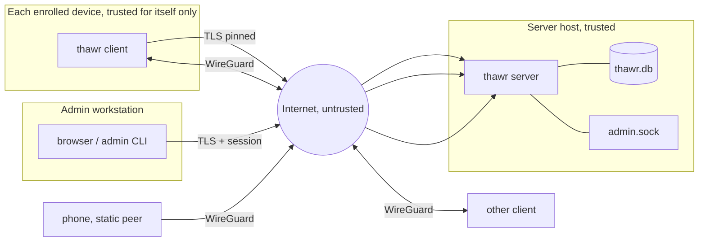

# Thawr — Threat Model

Scope: Thawr v1 as described in `docs/ARCHITECTURE.md`. Reviewed with
each spec that touches an item below.

## Assets

| Asset | Where | Loss means |
|---|---|---|
| A1 Peer WireGuard private keys | `node.key` on each device; server memory briefly for static peers | Attacker can impersonate that peer on the data plane |
| A2 Server WireGuard private key | `data_dir/server.key` | Attacker can impersonate the hub; decrypt static-peer traffic |
| A3 Node secrets | `state.json` on devices; SHA-256 in DB | Attacker can read that peer's netmap (keys, IPs, endpoints) and change its endpoints |
| A4 Enrollment tokens | Shown once; SHA-256 in DB | Attacker can enrol a device as the token's owner with its tags |
| A5 User passwords | argon2id hashes in DB | Admin UI takeover |
| A6 Server TLS private key | `data_dir/tls/key.pem` | Control-channel interception if fingerprint pinning is bypassed |
| A7 Netmap (peer list, IPs, endpoints, public keys) | Server memory, DB, client cache; the `.thawr` resolvers answer from it and only to the extent the policy makes a peer visible to the asker | Network topology disclosure; endpoints reveal locations |
| A8 Policy file | User's git repo, server memory | Wrong policy grants or denies access |
| A9 Data-plane traffic | Between peers | Confidentiality and integrity of user data |
| A10 SQLite database | `data_dir/thawr.db` | All of A3–A8 hashes and metadata |

## Trust boundaries

1. Internet ↔ server: TLS with fingerprint pinning for clients; TLS with
   a browser-trusted or manually accepted certificate for admins.
2. Peer ↔ peer: WireGuard with keys distributed by the server.
3. Server process ↔ admin socket: filesystem permissions.
4. Client daemon ↔ local CLI: local socket permissions.
5. Server ↔ static peers: the server is a WireGuard endpoint and sees
   plaintext; the boundary is inside the server host.

## Attacker models and mitigations

### T1 Network attacker (on-path, off-path, malicious Wi-Fi, ISP)

Can observe, modify, inject and drop packets between any two parties.

| Threat | Mitigation |
|---|---|
| Read or modify data-plane traffic | WireGuard (ChaCha20-Poly1305, authenticated). Not our code |
| Read or modify control-channel traffic | TLS 1.3 minimum; clients pin the server certificate fingerprint delivered out of band in the join command |
| Impersonate the server to a new client at enrollment | Fingerprint is part of the join command; the client refuses a mismatch. If the admin omits the fingerprint the client prints it and requires `--accept-fingerprint` to continue (explicit TOFU) |
| Impersonate the server to an existing client | Pinned fingerprint in `state.json`; rotation requires the client to receive the new fingerprint through the still-valid old channel |
| Replay control messages | TLS; gRPC streams are stateful; enrollment tokens are single-use |
| Learn topology from traffic analysis | Out of scope (endpoints and packet sizes are visible; WireGuard does not hide them) |
| Denial of service by dropping packets | Out of scope beyond relay fallback |
| Abuse the relay as an open reflector | Relay requires node-secret authentication before forwarding and forwards only between mutually visible peers |
| Abuse STUN for amplification | STUN responses are no larger than requests; server rate limits per source IP |

### T2 Malicious peer (an enrolled device, or its user, acting against the network)

Holds a valid node key, node secret, and receives a netmap.

| Threat | Mitigation |
|---|---|
| Reach peers or ports the policy forbids | Key distribution only includes visible peers; receiver-side stateful filter enforces ports; hub-side filter for static peers. Default deny |
| Spoof another peer's overlay IP | WireGuard cryptokey routing drops packets whose source is not in the sender's AllowedIPs (`/32` per peer). Filter matches on that verified source |
| Learn keys, IPs, endpoints of peers it cannot reach | Netmap is per-peer and contains only visible peers |
| Enrol additional devices | Requires a token; members can create tokens only for themselves, admins for anyone. Token creation is audited in the server log with token id |
| Modify policy or other peers | Node secret grants only `Sync`, `ReportEndpoints`, `ReportPath`, `RotateKey`, `Leave` for its own peer. No admin API on the gRPC channel |
| Flood the relay | Per-peer rate limit and per-peer frame queue with drop on overflow; relay sessions counted per peer |
| Report false endpoints to redirect another peer's traffic | A peer can only report its own endpoints. A victim's WireGuard would fail the handshake against a wrong endpoint; traffic is never sent in clear |
| Lie about `kind` or tags at enrollment | Kind and tags come from the token, set by the admin, not from the client |

### T3 Stolen or lost device

Attacker has physical access to an enrolled laptop or phone.

| Threat | Mitigation |
|---|---|
| Use the device's identity | Admin deletes the peer (`thawr admin peer delete`); every client removes the key within 5 seconds of the next netmap; relay refuses the node secret; hub drops the static peer. Fast, centralised revocation is the primary control |
| Read `node.key` and `state.json` | Files are 0600 owned by root/SYSTEM. Full-disk encryption is the user's responsibility and is recommended in docs |
| Use a cached netmap after revocation | The cache contains public keys and IPs of visible peers only; those peers no longer accept the revoked key |
| Recover a used enrollment token from shell history | Tokens are single-use and expire (default 1 h); the join command is the only place the secret appears |
| Static peer (phone) config export | `.conf` contains the private key; admins are told to display the QR once and not save the file. Deleting the peer revokes it |

### T4 Compromised server

Attacker has root on the server host or a copy of `data_dir`.

| Threat | Mitigation / residual risk |
|---|---|
| Decrypt peer-to-peer traffic | Not possible: the server never holds peer private keys or session keys for agent peers. Relay carries ciphertext. This is the main reason for the DERP-style relay over a hub-and-spoke design |
| Decrypt static-peer traffic | Possible: the hub terminates WireGuard for phones. Residual risk, documented in the QR export UI. Users needing end-to-end for phones must wait for a native client (non-goal v1) |
| Distribute malicious keys (insert an attacker peer as a "visible" peer, or swap a key) | Reduced (spec 011): every client pins the hub key and each peer's `(id, key)` under its name on first sight and holds a changed key out of the tunnel, DNS and the filter until the user runs `thawr client trust <name>`; the peer shows as `key changed` in status. A swap therefore stops traffic instead of redirecting it, and a rotation is a visible, deliberate act on every other device. Residual: first contact is trusted (the enrolment already trusts the server it talks to), a new peer under a new name is accepted, and an admin who runs `trust` without asking why the key changed accepts the swap. Signed peer records with an offline admin key remove the first-contact and new-name gaps (spec 012) |
| Steal node secrets | Only SHA-256 hashes are stored; the attacker cannot impersonate existing clients from the DB alone, but as the server they can serve them anything |
| Steal password hashes | argon2id (64 MiB, 3 iterations, 4 lanes) slows offline cracking; admins are told to use a password manager |
| Steal enrollment tokens | Hashed; unused tokens can be revoked by deleting `data_dir` and re-issuing |
| Persist after cleanup | All state is in `data_dir`; rebuilding the server from a clean binary and a clean directory invalidates every node secret (clients must re-enrol). Peers' WireGuard keys can be kept |

### T5 Malicious or careless admin

Out of scope for enforcement; the design limits blast radius: admins see
public keys, not private keys; token secrets are shown once; every admin
action is logged with user and peer id at `info` and recorded in the
`audit_log` table (spec 011: tokens, enrolments, static peers, renames,
deletions, key rotations, user creation, logins, policy reloads, with
the acting user, socket or peer, and key fingerprints instead of keys),
kept for `audit.retention_days` and listed with `thawr admin audit`,
`GET /api/v1/audit` and the UI. The log lives in the same database as
everything else: an admin with shell access to the server can edit it,
so it reconstructs what happened through the API, not what root did.

### T6 Supply chain

| Threat | Mitigation |
|---|---|
| Malicious dependency | Short dependency list, all pure Go, pinned in `go.sum`; `govulncheck` in CI; new dependencies need an entry in the architecture table |
| Tampered release binary | Releases are built by CI from tags; checksums published; reproducible builds (`-trimpath`, fixed build info) are a Phase 1 CI goal |

## Security requirements derived from the model

These are checked by tests where possible.

1. No private key, node secret, token secret, or password ever appears
   in logs, error messages, or API responses after creation
   (`TestNoSecretsInLogs` runs the enrollment flow with a capturing
   `slog.Handler` and greps for the secrets).
2. A peer receives in its netmap exactly the set of visible peers
   (`TestNetMapVisibility`).
3. Peer deletion propagates to a connected client within 5 seconds
   (integration test).
4. The relay drops frames between non-visible peers and from
   unauthenticated connections (`TestRelayVisibility`).
5. Enrollment with a used, expired, or unknown token fails with one
   indistinguishable error (`TestEnrollTokenErrors`).
6. Login is rate limited: 10 failures per user per 15 minutes, then
   exponential delay (`TestLoginRateLimit`).
7. Every file the server or client writes that contains a secret is
   created with mode 0600 and the directory 0700
   (`TestSecretFileModes`).
8. All REST mutating endpoints require the CSRF header and reject
   requests without a session (`TestRESTAuth`).
9. Client refuses to connect to a server whose TLS fingerprint differs
   from the pinned one (`TestFingerprintPin`).
10. A netmap whose hub key or a known peer's key differs from the pinned
    one is applied without that peer, and the peer returns only after
    `trust` (`TestDaemonHoldsChangedKey`, `TestDaemonHoldsChangedHubKey`,
    `TestPinsRenameAndSubstitution`).
11. Every control-plane mutation leaves exactly one audit row inside its
    own transaction, without secrets or full keys, and a mutation whose
    row cannot be written does not happen (`TestAuditEveryMutation`,
    `TestAuditFailureRollsBack`).

## Explicitly out of scope for v1

- Traffic analysis resistance, metadata hiding, cover traffic.
- Full protection against a compromised server distributing malicious
  keys: pinning (spec 011) holds swapped keys but trusts first contact;
  signed peer records are spec 012.
- Hardware-backed keys, TPM attestation, device posture.
- End-to-end encryption for static (mobile) peers.
- Multi-tenant isolation on one server.
- DoS resistance beyond basic rate limits.
- Physical security of the server host and disk encryption.
- Security of the host firewall outside the `thawr0` interface.
